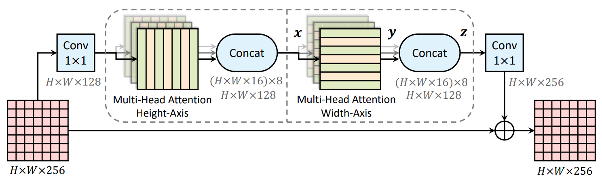
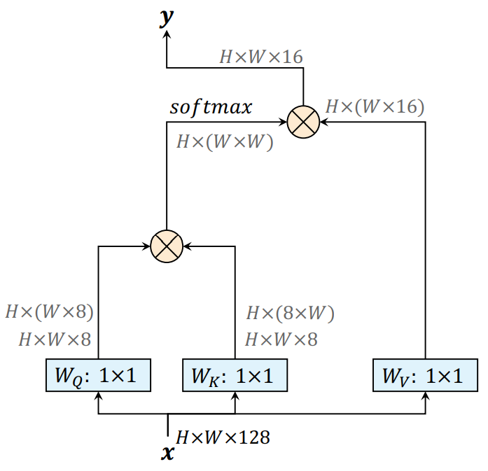
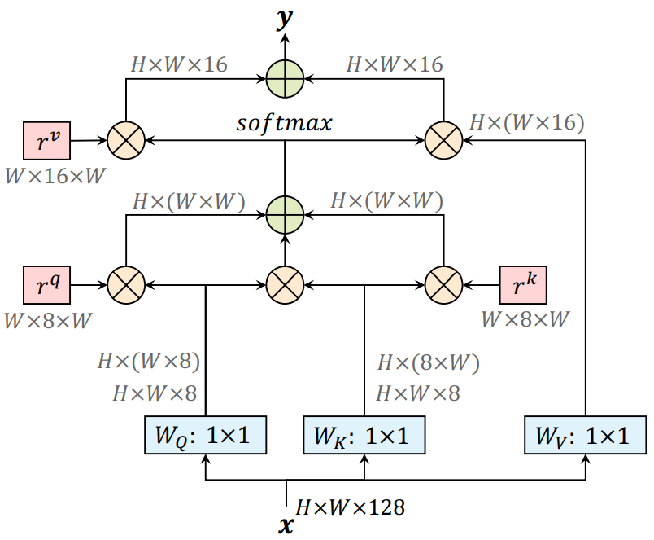

# Axial-DeepLab

Axial-DeepLab, improving over Panoptic-DeepLab, incorporates the powerful
axial self-attention modules [1], also known as the encoder of Axial
Transformers [2], for general dense prediction tasks. In this document,
we demonstrate the effectiveness of Axial-DeepLab on the task of panoptic
segmentation [6], unifying semantic segmentation and instance segmentation.

To reduce the computation complexity of 2D self-attention (especially
prominent for dense pixel prediction tasks) and further to allow us to
perform attention witin a larger or even global region, we factorize the 2D
self-attention [1, 3, 4] into **two** 1D self-attention [2, 5]. We then
effectively integrate the **axial-attention** into a residual block [7], as
illustrated in Fig. 1.

<p align="center">
   
   <br>
   <em>Figure 1. An axial-attention (residual) block, which consists of two
    axial-attention layers operating along height- and width-axis
    sequentially.</em>
</p>

The backbone of Axial-DeepLab, called Axial-ResNet, is obtained by replacing
the residual blocks in any type of ResNets (e.g., Wide ResNets [8, 9]) with
our proposed axial-attention blocks. Optionally, one could stack only the
axial-attention blocks to form an **axial** stand-alone self-attention
backbone. However, considering a better speed-accuracy trade-off
(convolutions are typically well-optimized on modern accelerators), we
adopt the hybrid CNN-Transformer architecture, where we stack the effective
**axial-attention blocks** on top of the first few stages of ResNets (e.g.,
Wide ResNets). In particular, in this document, we explore the case where
we stack the axial-attention blocks after the *conv3_x*, i.e., we apply
axial-attentions after (and *including*) stride 16 feature maps. This
hybrid CNN-Transformer architecture is very effective on panoptic
segmentation tasks as shown in the Model Zoo below.

Additionally, we propose a position-sensitive self-attention design,
which captures long range interactions with precise positional information.
We illustrate the difference between our design and the popular non-local
block in Fig. 2.

<p align="center">
   
   
</p>
<center><em>Figure 2. A non-local block (left) vs. our position-sensitive
axial-attention applied along the width-axis (right). $$\otimes$$ denotes
matrix multiplication, and $$\oplus$$ denotes elementwise sum. The softmax
is performed on the last axis. Blue boxes denote 1 × 1 convolutions, and
red boxes denote relative positionalencoding.</em></center>

## Prerequisite

1.  Make sure the software is properly [installed](../setup/installation.md).
    Tensorflow>=2.6 is needed for Axial-DeepLab training, because the attention
    layers depend on a
    [fix](https://github.com/tensorflow/tensorflow/commit/f5ead6f8e4de470fcf140360b304a4d788198090)
    for
    [SyncBatchNormalization](https://www.tensorflow.org/api_docs/python/tf/keras/layers/experimental/SyncBatchNormalization).

2.  Make sure the target dataset is correctly prepared (e.g.,
    [Cityscapes](../setup/cityscapes.md)).

3.  Download the ImageNet pretrained
    [checkpoints](./imagenet_pretrained_checkpoints.md), and update the
    `initial_checkpoint` path in the config files.

## Model Zoo

In the Model Zoo, we explore building axial-attention blocks on top of
SWideRNet (Scaling Wide ResNets) and MaX-DeepLab backbones (i.e., only
the ImageNet pretrained backbone without any *Mask Transformers*).

Herein, we highlight some of the employed backbones:

1. **Axial-SWideRNet-(1, 1, x)**, where x = $$\{1, 3, 4.5\}$$, scaling the
backbone layers (excluding the stem) of Wide-ResNet-41 by a factor of x. This
backbone augments the naive SWideRNet (i.e., no Squeeze-and-Excitation
or Switchable Atrous Convolution) with axial-attention blocks in the last
two stages.

2. **MaX-DeepLab-S-Backbone**: The ImageNet pretrained backbone of
MaX-DeepLab-S (i.e., without any *Mask Transformers*). This backbone augments
the ResNet-50-Beta (i.e., replacing the original stem with Inception stem)
with axial-attention blocks in the last two stages.

3. **MaX-DeepLab-L-Backbone**: The ImageNet pretrained backbone of
MaX-DeepLab-L (i.e., without any *Mask Transformers*). This backbone adds a
stacked decoder on top of the Wide ResNet-41, and incorporates
axial-attention blocks to all feature maps with output stride 16 and larger.

#### Cityscapes Panoptic Segmentation

We provide checkpoints pretrained on Cityscapes train-fine set below. If you
would like to train those models by yourself, please find the corresponding
config files under this [directory](../../configs/cityscapes/axial_deeplab).

All the reported results are obtained by *single-scale* inference and
*ImageNet-1K* pretrained checkpoints.

Backbone                                                                                                                                                                                                                                                             | Output stride | Input resolution | PQ [*] | mIoU [*] | PQ [**] | mIoU [**] | AP<sup>Mask</sup> [**]
-------------------------------------------------------------------------------------------------------------------------------------------------------------------------------------------------------------------------------------------------------------------- | :-----------: | :---------------: | :----: | :------: | :-----: | :-------: | :--------------------:
Axial-SWideRNet-(1, 1, 1) ([config](../../configs/cityscapes/axial_deeplab/axial_swidernet_1_1_1_os16.textproto), [ckpt](https://storage.googleapis.com/gresearch/tf-deeplab/checkpoint/axial_swidernet_1_1_1_os16_axial_deeplab_cityscapes_trainfine.tar.gz))       | 16            | 1025 x 2049       | 66.1   | 82.8     | 66.63   | 83.43     | 37.18
Axial-SWideRNet-(1, 1, 3) ([config](../../configs/cityscapes/axial_deeplab/axial_swidernet_1_1_3_os16.textproto), [ckpt](https://storage.googleapis.com/gresearch/tf-deeplab/checkpoint/axial_swidernet_1_1_3_os16_axial_deeplab_cityscapes_trainfine.tar.gz))       | 16            | 1025 x 2049       | 67.1   | 83.5     | 67.63   | 83.97     | 40.00
Axial-SWideRNet-(1, 1, 4.5) ([config](../../configs/cityscapes/axial_deeplab/axial_swidernet_1_1_4.5_os16.textproto), [ckpt](https://storage.googleapis.com/gresearch/tf-deeplab/checkpoint/axial_swidernet_1_1_4.5_os16_axial_deeplab_cityscapes_trainfine.tar.gz)) | 16            | 1025 x 2049       | 68.0   | 83.0     | 68.53   | 83.49     | 39.51
MaX-DeepLab-S-Backbone ([config](../../configs/cityscapes/axial_deeplab/max_deeplab_s_backbone_os16.textproto), [ckpt](https://storage.googleapis.com/gresearch/tf-deeplab/checkpoint/max_deeplab_s_backbone_os16_axial_deeplab_cityscapes_trainfine.tar.gz))        | 16            | 1025 x 2049       | 64.5   | 82.2     | 64.97   | 82.63     | 35.55
MaX-DeepLab-L-Backbone ([config](../../configs/cityscapes/axial_deeplab/max_deeplab_l_backbone_os16.textproto), [ckpt](https://storage.googleapis.com/gresearch/tf-deeplab/checkpoint/max_deeplab_l_backbone_os16_axial_deeplab_cityscapes_trainfine.tar.gz))        | 16            | 1025 x 2049       | 66.3   | 83.1     | 66.77   | 83.67     | 38.09

[*]: Results evaluated by the official script. Instance segmentation evaluation
is not supported yet (need to convert our prediction format).

[**]: Results evaluated by our pipeline. See Q4 in [FAQ](../faq.md).


## Citing Axial-DeepLab

If you find this code helpful in your research or wish to refer to the baseline
results, please use the following BibTeX entry.

* Axial-DeepLab:

```
@inproceedings{axial_deeplab_2020,
  author={Huiyu Wang and Yukun Zhu and Bradley Green and Hartwig Adam and Alan Yuille and Liang-Chieh Chen},
  title={{Axial-DeepLab}: Stand-Alone Axial-Attention for Panoptic Segmentation},
  booktitle={ECCV},
  year={2020}
}

```

* Panoptic-DeepLab:

```
@inproceedings{panoptic_deeplab_2020,
  author={Bowen Cheng and Maxwell D Collins and Yukun Zhu and Ting Liu and Thomas S Huang and Hartwig Adam and Liang-Chieh Chen},
  title={{Panoptic-DeepLab}: A Simple, Strong, and Fast Baseline for Bottom-Up Panoptic Segmentation},
  booktitle={CVPR},
  year={2020}
}

```

If you use the SWideRNet backbone w/ axial attention, please consider
citing

* SWideRNet:

```
@article{swidernet_2020,
  title={Scaling Wide Residual Networks for Panoptic Segmentation},
  author={Chen, Liang-Chieh and Wang, Huiyu and Qiao, Siyuan},
  journal={arXiv:2011.11675},
  year={2020}
}

```

If you use the MaX-DeepLab-{S,L} backbone, please consider
citing

* MaX-DeepLab:

```
@inproceedings{max_deeplab_2021,
  author={Huiyu Wang and Yukun Zhu and Hartwig Adam and Alan Yuille and Liang-Chieh Chen},
  title={{MaX-DeepLab}: End-to-End Panoptic Segmentation with Mask Transformers},
  booktitle={CVPR},
  year={2021}
}

```
