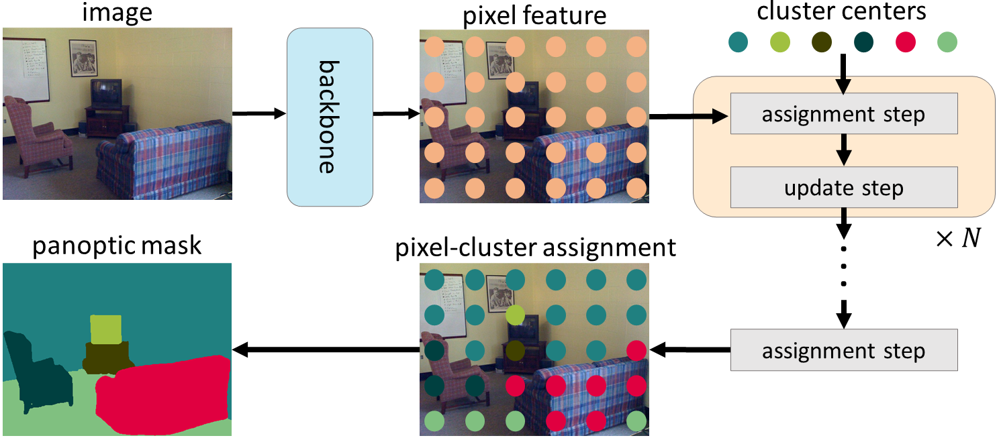
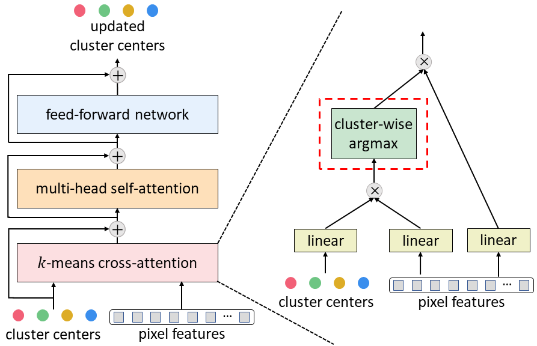

# kMaX-DeepLab

[kMaX-DeepLab](https://arxiv.org/pdf/2207.04044.pdf) is an end-to-end method for
general segmentation tasks. Built upon
[MaX-DeepLab](https://arxiv.org/pdf/2012.00759.pdf) [1] and
[CMT-DeepLab](https://arxiv.org/pdf/2206.08948.pdf) [2], kMaX-DeepLab proposes a
novel view to regard the mask transformer [1] as a process of iteratively
performing cluster-assignment and cluster-update steps.

<p align="center">
   
</p>

Insipred by the similarity between cross-attention and k-means clustering
algorithm, kMaX-DeepLab proposes k-means cross-attention, which adopts a simple
modification by changing the activation function in cross-attention from
spatial-wise softmax to cluster-wise argmax.

<p align="center">
   
</p>

As a result, kMaX-DeepLab not only produces much more plausible attention map
but also enjoys a much better performance.

## Prerequisite

1.  Make sure the software is properly [installed](../setup/installation.md).
    Tensorflow>=2.6 is needed for kMaX-DeepLab training, because the attention
    layers depend on a
    [fix](https://github.com/tensorflow/tensorflow/commit/f5ead6f8e4de470fcf140360b304a4d788198090)
    for
    [SyncBatchNormalization](https://www.tensorflow.org/api_docs/python/tf/keras/layers/experimental/SyncBatchNormalization).
    The merging module (merge_semantic_and_instance_maps_op) is not needed for
    kMaX-DeepLab, so one could skip compiling the merging operation.

2.  Make sure the target dataset is correctly prepared (e.g.,
    [COCO](../setup/coco.md), [Cityscapes](../setup/cityscapes.md)).

3.  Download the ImageNet pretrained
    [checkpoints](./imagenet_pretrained_checkpoints.md), and update the
    `initial_checkpoint` (for ResNet and MaX-S backbones) or
    `pretrained_weights` (for ConvNeXt backbones) path in the config files.

## Model Zoo

We explore kMaX-DeepLab model variants that are built on top of several
backbones (e.g., ResNet [3], MaX-S [1], and ConvNeXt [4]).

The ImageNet pretrained weights are located in
[checkpoints](./imagenet_pretrained_checkpoints.md). For the model zoo below,
we use the following pretrained checkpoints:

1. `Simple training strategy`: ResNet-50

2. `Strong training strategy`: Axial-ResNet-50 (MaX-S w/ GeLU)

3. `Converted from official weights`: ConvNeXt

### COCO Panoptic Segmentation

We provide checkpoints pretrained on COCO 2017 panoptic train set and evaluated
on the val set and test set. If you would like to train those models by
yourself, please find the corresponding config files under the directory
[configs/coco/kmax_deeplab](../../configs/coco/kmax_deeplab).

All the reported results are obtained by *single-scale* inference. ResNet-50 use
*ImageNet-1K* pretrained checkpoints, while the other backbones use
*ImageNet-22K* pretrained checkpoints.

Backbone                                                                                                                                                                                                                                | val PQ \[\*\] | val PQ<sup>thing</sup> \[\*\] | val PQ<sup>stuff</sup> \[\*\] | test PQ \[\*\] | test PQ<sup>thing</sup> \[\*\] | test PQ<sup>stuff</sup> | val PQ \[\*\*\]
--------------------------------------------------------------------------------------------------------------------------------------------------------------------------------------------------------------------------------------- | :-----------: | :---------------------------: | :---------------------------: | :------------: | :----------------------------: | :---------------------: | :-------------:
ResNet-50 ([config](../../configs/coco/kmax_deeplab/kmax_meta_r50_os32.textproto), [ckpt](https://storage.googleapis.com/gresearch/tf-deeplab/checkpoint/kmax_resnet50_coco_train.tar.gz))                                              | 53.0          | 58.3                          | 44.9                          | 53.4           | 59.3                           | 44.5                    | 53.50
Axial-ResNet-50 (MaX-S w/ GeLU) ([config](../../configs/coco/kmax_deeplab/kmax_meta_axial_r50_os32.textproto), [ckpt](https://storage.googleapis.com/gresearch/tf-deeplab/checkpoint/kmax_maxs_gelu_coco_train.tar.gz))                  | 56.2          | 62.2                          | 47.1                          | 56.4           | 62.7                           | 46.9                    | 56.71
ConvNeXt-T ([config](../../configs/coco/kmax_deeplab/kmax_meta_convnext_tiny_os32.textproto), [ckpt](https://storage.googleapis.com/gresearch/tf-deeplab/checkpoint/kmax_convnext_tiny_coco_train.tar.gz))                              | 55.3          | 61.0                          | 46.7                          | 55.7           | 61.7                           | 46.7                    | 55.80
ConvNeXt-S ([config](../../configs/coco/kmax_deeplab/kmax_meta_convnext_small_os32.textproto), [ckpt](https://storage.googleapis.com/gresearch/tf-deeplab/checkpoint/kmax_convnext_small_coco_train.tar.gz))                            | 56.3          | 62.2                          | 47.5                          | 57.0           | 63.3                           | 47.5                    | 56.86
ConvNeXt-B ([config](../../configs/coco/kmax_deeplab/kmax_meta_convnext_base_os32.textproto), [ckpt](https://storage.googleapis.com/gresearch/tf-deeplab/checkpoint/kmax_convnext_base_coco_train.tar.gz))                              | 57.2          | 63.4                          | 47.8                          | 57.8           | 64.3                           | 48.1                    | 57.73
ConvNeXt-L ([config](../../configs/coco/kmax_deeplab/kmax_meta_convnext_large_os32.textproto), [ckpt](https://storage.googleapis.com/gresearch/tf-deeplab/checkpoint/kmax_convnext_large_coco_train.tar.gz))                            | 57.9          | 64.0                          | 48.6                          | 58.0           | 64.5                           | 48.2                    | 58.38
ConvNeXt-L w/ unlabeled set ([config](../../configs/coco/kmax_deeplab/kmax_meta_convnext_large_os32.textproto), [ckpt](https://storage.googleapis.com/gresearch/tf-deeplab/checkpoint/kmax_convnext_large_coco_train_unlabeled.tar.gz)) | 58.1          | 64.3                          | 48.8                          | 58.5           | 64.8                           | 49.0                    | 58.69

\[\*\]: Results evaluated by the official script. \[\*\*\]: Results evaluated by
our pipeline. See Q4 in [FAQ](../faq.md).

### Cityscapes Panoptic/Semantic/Instance Segmentation

We provide checkpoints pretrained on Cityscapes train-fine set below and
evaluated on the val set. If you would like to train those models by yourself,
please find the corresponding config files under the directory
[configs/cityscapes/kmax_deeplab](../../configs/cityscapes/kmax_deeplab).

All the reported results are obtained by *single-scale* inference. ResNet-50 use
*ImageNet-1K* pretrained checkpoints, while the other backbones use
*ImageNet-22K* pretrained checkpoints.

Backbone                                                                                                                                                                                                                           | PQ \[\*\] | PQ<sup>thing</sup> \[\*\] | PQ<sup>stuff</sup> \[\*\] | AP<sup>mask</sup> \[\*\] | mIoU \[\*\] | PQ \[\*\*\]
---------------------------------------------------------------------------------------------------------------------------------------------------------------------------------------------------------------------------------- | :-------: | :-----------------------: | :-----------------------: | :----------------------: | :---------: | :---------:
ResNet-50 ([config](../../configs/cityscapes/kmax_deeplab/kmax_meta_r50_os32.textproto), [ckpt](https://storage.googleapis.com/gresearch/tf-deeplab/checkpoint/kmax_resnet50_cityscapes_train.tar.gz))                             | 64.3      | 57.7                      | 69.1                      | 38.5                     | 79.7        | 64.65
Axial-ResNet-50 (MaX-S w/ GeLU) ([config](../../configs/cityscapes/kmax_deeplab/kmax_meta_axial_r50_os32.textproto), [ckpt](https://storage.googleapis.com/gresearch/tf-deeplab/checkpoint/kmax_maxs_gelu_cityscapes_train.tar.gz)) | 66.4      | 61.2                      | 70.2                      | 41.6                     | 82.1        | 66.73
ConvNeXt-T ([config](../../configs/cityscapes/kmax_deeplab/kmax_meta_convnext_tiny_os32.textproto), [ckpt](https://storage.googleapis.com/gresearch/tf-deeplab/checkpoint/kmax_convnext_tiny_cityscapes_train.tar.gz))             | 66.3      | 60.2                      | 70.8                      | 41.2                     | 82.6        | 66.65
ConvNeXt-S ([config](../../configs/cityscapes/kmax_deeplab/kmax_meta_convnext_small_os32.textproto), [ckpt](https://storage.googleapis.com/gresearch/tf-deeplab/checkpoint/kmax_convnext_small_cityscapes_train.tar.gz))           | 67.3      | 61.6                      | 71.5                      | 42.6                     | 83.1        | 67.71
ConvNeXt-B ([config](../../configs/cityscapes/kmax_deeplab/kmax_meta_convnext_base_os32.textproto), [ckpt](https://storage.googleapis.com/gresearch/tf-deeplab/checkpoint/kmax_convnext_base_cityscapes_train.tar.gz))             | 68.0      | 62.6                      | 72.0                      | 43.0                     | 83.1        | 68.30
ConvNeXt-L ([config](../../configs/cityscapes/kmax_deeplab/kmax_meta_convnext_large_os32.textproto), [ckpt](https://storage.googleapis.com/gresearch/tf-deeplab/checkpoint/kmax_convnext_large_cityscapes_train.tar.gz))           | 68.4      | 62.9                      | 72.4                      | 44.0                     | 83.5        | 68.73

\[\*\]: Results evaluated by the official script. \[\*\*\]: Results evaluated by
our pipeline. See Q4 in [FAQ](../faq.md).

## Citing kMaX-DeepLab

If you find this code helpful in your research or wish to refer to the baseline
results, please use the following BibTeX entry.

*   kMaX-DeepLab:

```
@inproceedings{kmax_deeplab_2022,
  author={Qihang Yu and Huiyu Wang and Siyuan Qiao and Maxwell Collins and Yukun Zhu and Hartwig Adam and Alan Yuille and Liang-Chieh Chen},
  title={k-means Mask Transformer},
  booktitle={ECCV},
  year={2022}
}
```

*   CMT-DeepLab:

```
@inproceedings{cmt_deeplab_2022,
  author={Qihang Yu and Huiyu Wang and Dahun Kim and Siyuan Qiao and Maxwell Collins and Yukun Zhu and Hartwig Adam and Alan Yuille and Liang-Chieh Chen},
  title={CMT-DeepLab: Clustering Mask Transformers for Panoptic Segmentation},
  booktitle={CVPR},
  year={2022}
}
```

### References

1.  Huiyu Wang, Yukun Zhu, Hartwig Adam, Alan Yuille, and Liang-Chieh Chen.
    "MaX-DeepLab: End-to-End Panoptic Segmentation With Mask Transformers." In
    CVPR, 2021.

2.  Qihang Yu, Huiyu Wang, Dahun Kim, Siyuan Qiao, Maxwell Collins, Yukun Zhu,
    Hartwig Adam, Alan Yuille, and Liang-Chieh Chen. "CMT-DeepLab: Clustering
    Mask Transformers for Panoptic Segmentation." In CVPR, 2022.

3.  Kaiming He, Xiangyu Zhang, Shaoqing Ren, and Jian Sun. "Deep residual
    learning for image recognition." In CVPR, 2016.

4.  Zhuang Liu, Hanzi Mao, Chao-Yuan Wu, Christoph Feichtenhofer, Trevor
    Darrell, and Saining Xie. "A ConvNet for the 2020s." In CVPR, 2022.
