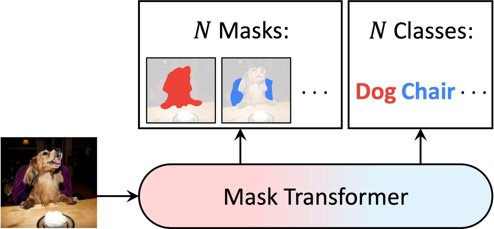
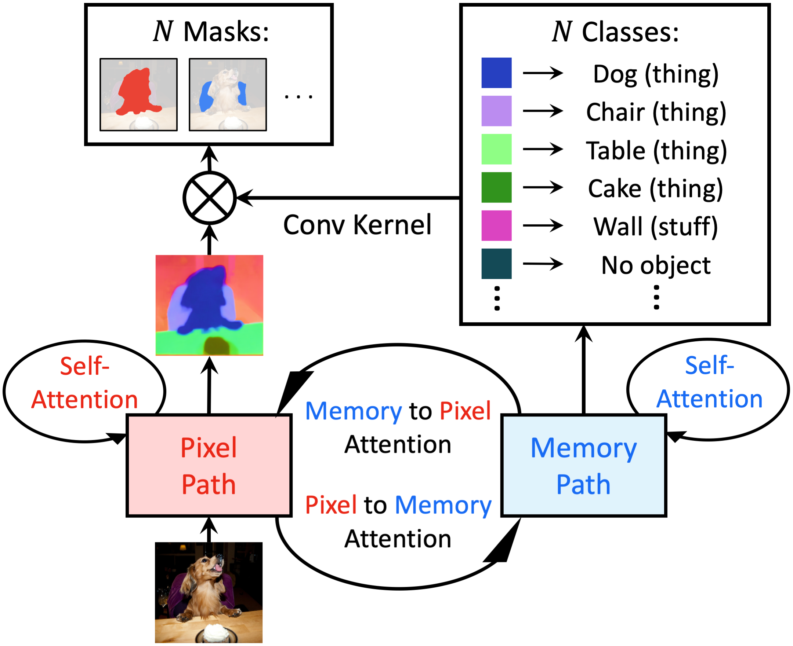

# MaX-DeepLab

MaX-DeepLab is the first fully **end-to-end** method for panoptic segmentation
[1], removing the needs for previously hand-designed priors such as object
bounding boxes (used in DETR [2]), instance centers (used in Panoptic-DeepLab
[3]), non-maximum suppression, thing-stuff merging, *etc*.

The goal of panoptic segmentation is to predict a set of non-overlapping masks
along with their corresponding class labels (e.g., person, car, road, sky).
MaX-DeepLab achieves this goal directly by predicting a set of class-labeled
masks with a mask transformer.

<p align="center">
   
</p>

The mask transformer is trained end-to-end with a panoptic quality (PQ) inspired
loss function, which matches and optimizes the predicted masks to the ground
truth masks with a PQ-style similarity metric. In addition, our proposed mask
transformer introduces a global memory path beside the pixel path CNN and
employs all 4 types of attention between the two paths, allowing the CNN to read
and write the global memory in any layer.

<p align="center">
   
</p>

## Prerequisite

1.  Make sure the software is properly [installed](../setup/installation.md).
    Tensorflow>=2.6 is needed for MaX-DeepLab training, because the attention
    layers depend on a
    [fix](https://github.com/tensorflow/tensorflow/commit/f5ead6f8e4de470fcf140360b304a4d788198090)
    for
    [SyncBatchNormalization](https://www.tensorflow.org/api_docs/python/tf/keras/layers/experimental/SyncBatchNormalization).
    The merging module (merge_semantic_and_instance_maps_op) is not needed for
    MaX-DeepLab, so one could skip compiling the merging operation.

2.  Make sure the target dataset is correctly prepared (e.g.,
    [COCO](../setup/coco.md)).

3.  Download the ImageNet pretrained
    [checkpoints](./imagenet_pretrained_checkpoints.md), and update the
    `initial_checkpoint` path in the config files.

## Model Zoo

We explore MaX-DeepLab model variants that are built on top of several backbones
(e.g., ResNet model variants [4]).

1.  **MaX-DeepLab-S** replaces the last two stages of ResNet-50-beta with
    axial-attention blocks and applies a small dual-path transformer.
    (ResNet-50-beta replaces the ResNet-50 stem with the Inception stem [5].)

### COCO Panoptic Segmentation

We provide checkpoints pretrained on COCO 2017 panoptic train set and evaluated
on the val set. If you would like to train those models by yourself, please find
the corresponding config files under the directory
[configs/coco/max_deeplab](../../configs/coco/max_deeplab).

All the reported results are obtained by *single-scale* inference and
*ImageNet-1K* pretrained checkpoints.

Model                                                                                                                                                                                                                        | Input Resolution | Training Steps | PQ \[\*\] | PQ<sup>thing</sup> \[\*\] | PQ<sup>stuff</sup> \[\*\] | PQ \[\*\*\]
---------------------------------------------------------------------------------------------------------------------------------------------------------------------------------------------------------------------------- | :--------------: | :------------: | :-------: | :-----------------------: | :-----------------------: | :---------:
MaX-DeepLab-S ([config](../../configs/coco/max_deeplab/max_deeplab_s_os16_res641_100k.textproto), [ckpt](https://storage.googleapis.com/gresearch/tf-deeplab/checkpoint/max_deeplab_s_os16_res641_100k_coco_train.tar.gz))   | 641 x 641        | 100k           | 45.9      | 49.2                      | 40.9                      | 46.36
MaX-DeepLab-S ([config](../../configs/coco/max_deeplab/max_deeplab_s_os16_res641_200k.textproto), [ckpt](https://storage.googleapis.com/gresearch/tf-deeplab/checkpoint/max_deeplab_s_os16_res641_200k_coco_train.tar.gz))   | 641 x 641        | 200k           | 46.5      | 50.6                      | 40.4                      | 47.04
MaX-DeepLab-S ([config](../../configs/coco/max_deeplab/max_deeplab_s_os16_res641_400k.textproto), [ckpt](https://storage.googleapis.com/gresearch/tf-deeplab/checkpoint/max_deeplab_s_os16_res641_400k_coco_train.tar.gz))   | 641 x 641        | 400k           | 47.0      | 51.3                      | 40.5                      | 47.56
MaX-DeepLab-S ([config](../../configs/coco/max_deeplab/max_deeplab_s_os16_res1025_100k.textproto), [ckpt](https://storage.googleapis.com/gresearch/tf-deeplab/checkpoint/max_deeplab_s_os16_res1025_100k_coco_train.tar.gz)) | 1025 x 1025      | 100k           | 47.9      | 52.1                      | 41.5                      | 48.41
MaX-DeepLab-S ([config](../../configs/coco/max_deeplab/max_deeplab_s_os16_res1025_200k.textproto), [ckpt](https://storage.googleapis.com/gresearch/tf-deeplab/checkpoint/max_deeplab_s_os16_res1025_200k_coco_train.tar.gz)) | 1025 x 1025      | 200k           | 48.7      | 53.6                      | 41.3                      | 49.23
MaX-DeepLab-S ([config](../../configs/coco/max_deeplab/max_deeplab_s_os16_res1025_400k.textproto), [ckpt](https://storage.googleapis.com/gresearch/tf-deeplab/checkpoint/max_deeplab_s_os16_res1025_400k_coco_train.tar.gz)) | 1025 x 1025      | 400k           | 49.0      | 54.0                      | 41.4                      | 49.54
MaX-DeepLab-L ([config](../../configs/coco/max_deeplab/max_deeplab_l_os16_res1025_100k.textproto), [ckpt](https://storage.googleapis.com/gresearch/tf-deeplab/checkpoint/max_deeplab_l_os16_res1025_100k_coco_train.tar.gz)) | 1025 x 1025      | 100k           | 50.9      | 56.9                      | 42.0                      | 51.48
MaX-DeepLab-L ([config](../../configs/coco/max_deeplab/max_deeplab_l_os16_res1025_200k.textproto), [ckpt](https://storage.googleapis.com/gresearch/tf-deeplab/checkpoint/max_deeplab_l_os16_res1025_200k_coco_train.tar.gz)) | 1025 x 1025      | 200k           | 51.1      | 56.8                      | 42.5                      | 51.64
MaX-DeepLab-L ([config](../../configs/coco/max_deeplab/max_deeplab_l_os16_res1025_400k.textproto), [ckpt](https://storage.googleapis.com/gresearch/tf-deeplab/checkpoint/max_deeplab_l_os16_res1025_400k_coco_train.tar.gz)) | 1025 x 1025      | 400k           | 51.3      | 57.5                      | 42.0                      | 51.87

\[\*\]: Results evaluated by the official script. \[\*\*\]: Results evaluated by
our pipeline. See Q4 in [FAQ](../faq.md).

Note that the results are slightly different from the paper, because of the
implementation differences:

1.  Stronger pretrained checkpoints are used in this repo.
2.  A `linear` drop path schedule is used, rather than a `constant` schedule.
3.  For simplicity, Adam [6] is used without weight decay, rather than Radam [7]
    LookAhead [8] with weight decay.

## Citing MaX-DeepLab

If you find this code helpful in your research or wish to refer to the baseline
results, please use the following BibTeX entry.

*   MaX-DeepLab:

```
@inproceedings{max_deeplab_2021,
  author={Huiyu Wang and Yukun Zhu and Hartwig Adam and Alan Yuille and Liang-Chieh Chen},
  title={{MaX-DeepLab}: End-to-End Panoptic Segmentation with Mask Transformers},
  booktitle={CVPR},
  year={2021}
}
```

*   Axial-DeepLab:

```
@inproceedings{axial_deeplab_2020,
  author={Huiyu Wang and Yukun Zhu and Bradley Green and Hartwig Adam and Alan Yuille and Liang-Chieh Chen},
  title={{Axial-DeepLab}: Stand-Alone Axial-Attention for Panoptic Segmentation},
  booktitle={ECCV},
  year={2020}
}
```

### References

1.  Alexander Kirillov, Kaiming He, Ross Girshick, Carsten Rother, and Piotr
    Dollar. "Panoptic segmentation." In CVPR, 2019.

2.  Nicolas Carion, Francisco Massa, Gabriel Synnaeve, Nicolas Usunier,
    Alexander Kirillov, and Sergey Zagoruyko. "End-to-End Object Detection with
    Transformers." In ECCV, 2020.

3.  Bowen Cheng, Maxwell D. Collins, Yukun Zhu, Ting Liu, Thomas S. Huang,
    Hartwig Adam, and Liang-Chieh Chen. "Panoptic-DeepLab: A Simple, Strong, and
    Fast Baseline for Bottom-Up Panoptic Segmentation." In CVPR 2020.

4.  Kaiming He, Xiangyu Zhang, Shaoqing Ren, and Jian Sun. "Deep residual
    learning for image recognition." In CVPR, 2016.

5.  Christian Szegedy, Vincent Vanhoucke, Sergey Ioffe, Jon Shlens, and Zbigniew
    Wojna. "Rethinking the inception architecture for computer vision." In
    CVPR, 2016.

6.  Diederik P. Kingma, and Jimmy Ba. "Adam: A Method for Stochastic
    Optimization" In ICLR, 2015.

7.  Liyuan Liu, Haoming Jiang, Pengcheng He, Weizhu Chen, Xiaodong Liu, Jianfeng
    Gao, and Jiawei Han. "On the Variance of the Adaptive Learning Rate and
    Beyond" In ICLR, 2020.

8.  Michael R. Zhang, James Lucas, Geoffrey Hinton, and Jimmy Ba. "Lookahead
    Optimizer: k steps forward, 1 step back" In NeurIPS, 2019.
