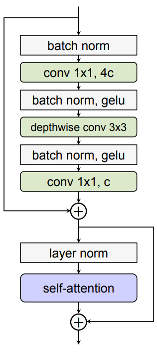
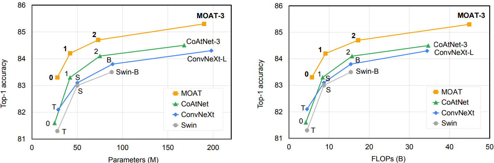

# MOAT ImageNet-pretrained checkpoints

MOAT is a novel family of neural networks that build on top of **MO**bile
convolution (i.e., inverted residual blocks) and **AT**tention. On the
popular ImageNet image classification benchmark, it attains a remarkable
trade-off of accuracy v.s. params and accuracy v.s. FLOPs by efficiently
merging Mobile convolution and self-attention into one MOAT block. We
illustrate the key component, MOAT block, in the following figure.

   

Using ImageNet-1K only with input size 224:

   

Using ImageNet-22K and ImageNet-1K with input size 384:

   

To facilitate the MOAT model training, we also provide some checkpoints that are
pretrained on ImageNet. For details about MOAT, please refer to [1].

After downloading the desired pretrained checkpoint, remember to update
the `pretrained_weights` path in the config files for downstream tasks (e.g.,
panoptic segmentation).

## ImageNet-pretrained checkpoints

We provide two MOAT ImageNet-pretrained families: **strong** and **tiny**
MOAT families, where the **strong** MOAT family focuses on strong ImageNet
classification performance while the **tiny** MOAT family are light-weight
MOAT model variants. For each family, we additionally provide the checkpoints
*without* using the positional embedding, which are insensitive to input
resolution and thus generalize better to downstream tasks. We report
the top-1 accuracy evaluated on the ImageNet-1K validation set in the following
tables.

### strong-MOAT family:

In the following table, we provide strong-MOAT family ImageNet-pretrained
checkpoints **with** positional embedding.

backbone  | positional embedding | input size | data              | params  | FLOPs   | top-1 accuracy
:---      | :---:                | :---:      | :---:             | :---:   | :---:   | :---:
MOAT-0 ([initial_checkpoint](https://storage.googleapis.com/gresearch/tf-deeplab/checkpoint/moat0_imagenet_1k_224_with_position_embedding.tar.gz)) | yes                  | 224        | ImageNet-1K       | 27.8M   | 5.7B    | 83.3%
MOAT-1  ([initial_checkpoint](https://storage.googleapis.com/gresearch/tf-deeplab/checkpoint/moat1_imagenet_1k_224_with_position_embedding.tar.gz)) | yes                  | 224        | ImageNet-1K       | 41.6M   | 9.1B    | 84.2%
MOAT-2  ([initial_checkpoint](https://storage.googleapis.com/gresearch/tf-deeplab/checkpoint/moat2_imagenet_22k_and_1k_384_with_position_embedding.tar.gz)) | yes                  | 384        | ImageNet-22K + 1K | 73.4M   | 54.3B   | 87.5%
MOAT-3  ([initial_checkpoint](https://storage.googleapis.com/gresearch/tf-deeplab/checkpoint/moat3_imagenet_22k_and_1k_512_with_position_embedding.tar.gz)) | yes                  | 512        | ImageNet-22K + 1K | 190.0M  | 271.0B  | 88.4%
MOAT-4  ([initial_checkpoint](https://storage.googleapis.com/gresearch/tf-deeplab/checkpoint/moat4_imagenet_22k_and_1k_512_with_position_embedding.tar.gz)) | yes                  | 512        | ImageNet-22K + 1K | 483.2M  | 648.5B  | 89.1%

In the following table, we provide strong-MOAT family ImageNet-pretrained
checkpoints **without** positional embedding.

backbone  | positional embedding | input size | data              | params  | FLOPs   | top-1 accuracy
:---      | :---:                | :---:      | :---:             | :---:   | :---:   | :---:
MOAT-0 ([initial_checkpoint](https://storage.googleapis.com/gresearch/tf-deeplab/checkpoint/moat0_imagenet_1k_224_without_position_embedding.tar.gz)) | no                   | 224        | ImageNet-1K       | 27.8M   | 5.7B    | 83.0%
MOAT-1 ([initial_checkpoint](https://storage.googleapis.com/gresearch/tf-deeplab/checkpoint/moat1_imagenet_1k_224_without_position_embedding.tar.gz)) | no                   | 224        | ImageNet-1K       | 41.5M   | 9.1B    | 84.1%
MOAT-2 ([initial_checkpoint](https://storage.googleapis.com/gresearch/tf-deeplab/checkpoint/moat2_imagenet_22k_and_1k_384_without_position_embedding.tar.gz)) | no                   | 384        | ImageNet-22K + 1K | 73.2M   | 53.8B   | 87.2%
MOAT-3 ([initial_checkpoint](https://storage.googleapis.com/gresearch/tf-deeplab/checkpoint/moat3_imagenet_22k_and_1k_512_without_position_embedding.tar.gz)) | no                   | 512        | ImageNet-22K + 1K | 189.5M  | 266.1B  | 88.2%
MOAT-4 ([initial_checkpoint](https://storage.googleapis.com/gresearch/tf-deeplab/checkpoint/moat4_imagenet_22k_and_1k_512_without_position_embedding.tar.gz)) | no                   | 512        | ImageNet-22K + 1K | 482.5M  | 640.6B  | 88.9%

### tiny-MOAT family:

In the following table, we provide tiny-MOAT family ImageNet-pretrained
checkpoints **with** positional embedding.

backbone    | positional embedding | input size | data            | params  | FLOPs   | top-1 accuracy
:---        | :---:                | :---:      | :---:           | :---:   | :---:   | :---:
tiny-MOAT-0 ([initial_checkpoint](https://storage.googleapis.com/gresearch/tf-deeplab/checkpoint/tiny_moat0_imagenet_1k_256_with_position_embedding.tar.gz)) | yes                  | 256        | ImageNet-1K     | 3.4M    | 1.1B    | 76.6%
tiny-MOAT-1 ([initial_checkpoint](https://storage.googleapis.com/gresearch/tf-deeplab/checkpoint/tiny_moat1_imagenet_1k_256_with_position_embedding.tar.gz)) | yes                  | 256        | ImageNet-1K     | 5.1M    | 1.6B    | 79.2%
tiny-MOAT-2 ([initial_checkpoint](https://storage.googleapis.com/gresearch/tf-deeplab/checkpoint/tiny_moat2_imagenet_1k_256_with_position_embedding.tar.gz)) | yes                  | 256        | ImageNet-1K     | 9.8M    | 3.0B    | 81.7%
tiny-MOAT-3 ([initial_checkpoint](https://storage.googleapis.com/gresearch/tf-deeplab/checkpoint/tiny_moat3_imagenet_1k_256_with_position_embedding.tar.gz)) | yes                  | 256        | ImageNet-1K     | 19.5M   | 6.0B    | 83.2%

In the following table, we provide tiny-MOAT family ImageNet-pretrained
checkpoints **without** positional embedding.

backbone    | positional embedding | input size | data            | params  | FLOPs   | top-1 accuracy
:---        | :---:                | :---:      | :---:           | :---:   | :---:   | :---:
tiny-MOAT-0 ([initial_checkpoint](https://storage.googleapis.com/gresearch/tf-deeplab/checkpoint/tiny_moat0_imagenet_1k_256_without_position_embedding.tar.gz)) | no                   | 256        | ImageNet-1K     | 3.3M    | 1.1B    | 76.0%
tiny-MOAT-1 ([initial_checkpoint](https://storage.googleapis.com/gresearch/tf-deeplab/checkpoint/tiny_moat1_imagenet_1k_256_without_position_embedding.tar.gz)) | no                   | 256        | ImageNet-1K     | 5.1M    | 1.6B    | 78.9%
tiny-MOAT-2 ([initial_checkpoint](https://storage.googleapis.com/gresearch/tf-deeplab/checkpoint/tiny_moat2_imagenet_1k_256_without_position_embedding.tar.gz)) | no                   | 256        | ImageNet-1K     | 9.7M    | 3.0B    | 81.3%
tiny-MOAT-3 ([initial_checkpoint](https://storage.googleapis.com/gresearch/tf-deeplab/checkpoint/tiny_moat3_imagenet_1k_256_without_position_embedding.tar.gz)) | no                   | 256        | ImageNet-1K     | 19.5M   | 6.0B    | 83.0%

### References

1. Chenglin Yang, Siyuan Qiao, Qihang Yu, Xiaoding Yuan, Yukun Zhu,
   Alan Yuille, Hartwig Adam, and Liang-Chieh Chen. MOAT: Alternating
   Mobile Convolution and Attention Brings Strong Vision Models.
   arXiv:2210.01820, 2022.

2. Mark Sandler, Andrew Howard, Menglong Zhu, Andrey Zhmoginov, and
   Liang-Chieh Chen. MobileNetV2: Inverted Residuals and Linear
   Bottlenecks. In CVPR, 2018.

3. Ashish Vaswani, Noam Shazeer, Niki Parmar, Jakob Uszkoreit, Llion
   Jones, Aidan N. Gomez, Lukasz Kaiser, and Illia Polosukhin. Attention
   Is All You Need. In NeurIPS, 2017.

4. Olga Russakovsky, Jia Deng, Hao Su, Jonathan Krause, Sanjeev Satheesh,
   Sean Ma, Zhiheng Huang, Andrej Karpathy, Aditya Khosla,
   Michael Bernstein, Alexander C. Berg, and Li Fei-Fei. ImageNet Large
   Scale Visual Recognition Challenge. IJCV, 2015.

5. Ze Liu, Yutong Lin, Yue Cao, Han Hu, Yixuan Wei, Zheng Zhang, Stephen
   Lin, and Baining Guo. Swin Transformer: Hierarchical Vision
   Transformer using Shifted Windows. In ICCV, 2021.

6. Zihang Dai, Hanxiao Liu, Quoc V. Le, Mingxing Tan. CoAtNet: Marrying
   Convolution and Attention for All Data Sizes. In NeurIPS, 2021.

7. Zhuang Liu, Hanzi Mao, Chao-Yuan Wu, Christoph Feichtenhofer, Trevor
   Darrell, and Saining Xie. A ConvNet for the 2020s. In CVPR, 2022.
