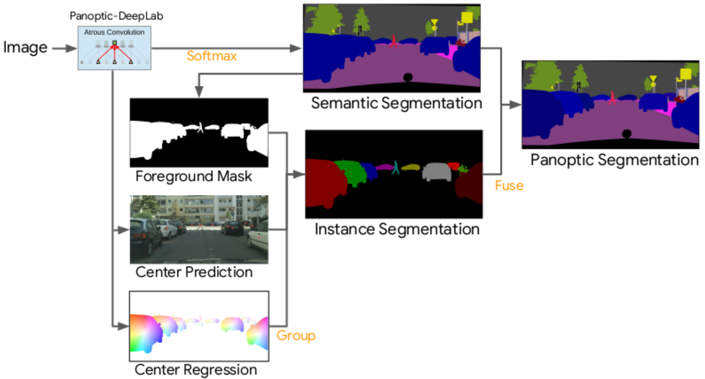

# Panoptic-DeepLab

Panoptic-DeepLab is a state-of-the-art **box-free** system for panoptic
segmentation [1], where the goal is to assign a unique value, encoding both
semantic label (e.g., person, car) and instance ID (e.g., instance_1,
instance_2), to every pixel in an image.

Panoptic-DeepLab improves over the DeeperLab [6], which is one of the first
box-free systems for panoptic segmentation combining DeepLabv3+ [7] and
PersonLab [8], by simplifying the class-agnostic instance detection to only use
a center keypoint. As a result, Panoptic-DeepLab predicts three outputs: (1)
semantic segmentation, (2) instance center heatmap, and (3) instance center
regression.

The class-agnostic instance segmentation is first obtained by grouping
the predicted foreground pixels (inferred by semantic segmentation) to their
closest predicted instance centers [2]. To generate final panoptic segmentation,
we then fuse the class-agnostic instance segmentation with semantic segmentation
by the efficient majority-vote scheme [6].


<p align="center">
   
</p>


## Prerequisite

1. Make sure the software is properly [installed](../setup/installation.md).

2. Make sure the target dataset is correctly prepared (e.g.,
[Cityscapes](../setup/cityscapes.md), [COCO](../setup/coco.md)).

3. Download the ImageNet pretrained
[checkpoints](./imagenet_pretrained_checkpoints.md), and update the
`initial_checkpoint` path in the config files.

## Model Zoo

In the Model Zoo, we explore building Panoptic-DeepLab on top of several
backbones (e.g., ResNet model variants [3]).

Herein, we highlight some of the employed backbones:

1. **ResNet-50-Beta**: We replace the original stem in ResNet-50 [3] with the
Inception stem [9], i.e., the first original 7x7 convolution is replaced
by three 3x3 convolutions.

2. **Wide-ResNet-41**: We modify the Wide-ResNet-38 [5] by (1) removing the
last residual block, and (2) repeating the second last residual block two
more times.

3. **SWideRNet-SAC-(1, 1, x)**, where x = $$\{1, 3, 4.5\}$$, scaling the
backbone layers (excluding the stem) of Wide-ResNet-41 by a factor of x. This
backbone only employs the Switchable Atrous Convolution (SAC) without the
Squeeze-and-Excitation modules [10].

### Cityscapes Panoptic Segmentation

We provide checkpoints pretrained on Cityscapes train-fine set below. If you
would like to train those models by yourself, please find the corresponding
config files under the directory
[configs/cityscapes/panoptic_deeplab](../../configs/cityscapes/panoptic_deeplab).

All the reported results are obtained by *single-scale* inference and
*ImageNet-1K* pretrained checkpoints.

Backbone                                                                                                                                                                                                                                                             | Output stride | Input resolution | PQ [*] | mIoU [*] | PQ [**] | mIoU [**] | AP<sup>Mask</sup> [**]
-------------------------------------------------------------------------------------------------------------------------------------------------------------------------------------------------------------------------------------------------------------------- | :-----------: | :--------------: | :----: | :------: | :-----: | :-------: | :--------------------:
MobilenetV3-S ([config](../../configs/cityscapes/panoptic_deeplab/mobilenet_v3_small_os16.textproto), [ckpt](https://storage.googleapis.com/gresearch/tf-deeplab/checkpoint/mobilenet_v3_small_os16_panoptic_deeplab_cityscapes_dwo.tar.gz))                         | 16            | 1025 x 2049      | 48.4   | 69.5     | 48.67   | 69.85     | 17.32
MobilenetV3-L ([config](../../configs/cityscapes/panoptic_deeplab/mobilenet_v3_large_os16.textproto), [ckpt](https://storage.googleapis.com/gresearch/tf-deeplab/checkpoint/mobilenet_v3_large_os16_panoptic_deeplab_cityscapes_dwo.tar.gz))                         | 16            | 1025 x 2049      | 55.3   | 74.5     | 55.51   | 74.77     | 24.06
ResNet-50 ([config](../../configs/cityscapes/panoptic_deeplab/resnet50_os32_merge_with_pure_tf_func.textproto), [ckpt](https://storage.googleapis.com/gresearch/tf-deeplab/checkpoint/resnet50_os32_panoptic_deeplab_cityscapes_trainfine.tar.gz))                   | 32            | 1025 x 2049      | 59.8   | 76.0     | 60.24   | 76.36     | 30.01
ResNet-50-Beta ([config](../../configs/cityscapes/panoptic_deeplab/resnet50_beta_os32.textproto), [ckpt](https://storage.googleapis.com/gresearch/tf-deeplab/checkpoint/resnet50_beta_os32_panoptic_deeplab_cityscapes_trainfine.tar.gz))                            | 32            | 1025 x 2049      | 60.8   | 77.0     | 61.16   | 77.37     | 31.58
Wide-ResNet-41 ([config](../../configs/cityscapes/panoptic_deeplab/wide_resnet41_os16.textproto), [ckpt](https://storage.googleapis.com/gresearch/tf-deeplab/checkpoint/wide_resnet41_os16_panoptic_deeplab_cityscapes_trainfine.tar.gz))                            | 16            | 1025 x 2049      | 64.4   | 81.5     | 64.83   | 81.92     | 36.07
SWideRNet-SAC-(1, 1, 1) ([config](../../configs/cityscapes/panoptic_deeplab/swidernet_sac_1_1_1_os16.textproto), [ckpt](https://storage.googleapis.com/gresearch/tf-deeplab/checkpoint/swidernet_sac_1_1_1_os16_panoptic_deeplab_cityscapes_trainfine.tar.gz))       | 16            | 1025 x 2049      | 64.3   | 81.8     | 64.81   | 82.24     | 36.80
SWideRNet-SAC-(1, 1, 3) ([config](../../configs/cityscapes/panoptic_deeplab/swidernet_sac_1_1_3_os16.textproto), [ckpt](https://storage.googleapis.com/gresearch/tf-deeplab/checkpoint/swidernet_sac_1_1_3_os16_panoptic_deeplab_cityscapes_trainfine.tar.gz)))      | 16            | 1025 x 2049      | 66.6   | 82.1     | 67.05   | 82.67     | 38.59
SWideRNet-SAC-(1, 1, 4.5) ([config](../../configs/cityscapes/panoptic_deeplab/swidernet_sac_1_1_4.5_os16.textproto), [ckpt](https://storage.googleapis.com/gresearch/tf-deeplab/checkpoint/swidernet_sac_1_1_4.5_os16_panoptic_deeplab_cityscapes_trainfine.tar.gz)) | 16            | 1025 x 2049      | 66.8   | 82.2     | 67.29   | 82.74     | 39.51

[*]: Results evaluated by the official script. Instance segmentation evaluation
is not supported yet (need to convert our prediction format).

[**]: Results evaluated by our pipeline. See Q4 in [FAQ](../faq.md).

### COCO Panoptic Segmentation

We provide checkpoints pretrained on COCO train set below. If you would like to
train those models by yourself, please find the corresponding config files under
the directory
[configs/coco/panoptic_deeplab](../../configs/coco/panoptic_deeplab).

All the reported results are obtained by *single-scale* inference and
*ImageNet-1K* pretrained checkpoints.

Backbone                                                                                                                                                                                                                 | Output stride | Input resolution | PQ [*] | PQ [**] | mIoU [**] | AP<sup>Mask</sup> [**]
------------------------------------------------------------------------------------------------------------------------------------------------------------------------------------------------------------------------ | :-----------: | :---------------: | :----: | :-----: | :-------: | :--------------------:
ResNet-50 ([config](../../configs/coco/panoptic_deeplab/resnet50_os32.textproto), [ckpt](https://storage.googleapis.com/gresearch/tf-deeplab/checkpoint/resnet50_os32_panoptic_deeplab_coco_train_2.tar.gz))             | 32            | 641 x 641         | 34.1   | 34.60   | 54.75     | 18.50
ResNet-50-Beta ([config](../../configs/coco/panoptic_deeplab/resnet50_beta_os32.textproto), [ckpt](https://storage.googleapis.com/gresearch/tf-deeplab/checkpoint/resnet50beta_os32_panoptic_deeplab_coco_train.tar.gz)) | 32            | 641 x 641         | 34.6   | 35.10   | 54.98     | 19.24
ResNet-50 ([config](../../configs/coco/panoptic_deeplab/resnet50_os16.textproto), [ckpt](https://storage.googleapis.com/gresearch/tf-deeplab/checkpoint/resnet50_os16_panoptic_deeplab_coco_train.tar.gz))               | 16            | 641 x 641         | 35.1   | 35.67   | 55.52     | 19.40
ResNet-50-Beta ([config](../../configs/coco/panoptic_deeplab/resnet50_beta_os16.textproto), [ckpt](https://storage.googleapis.com/gresearch/tf-deeplab/checkpoint/resnet50beta_os16_panoptic_deeplab_coco_train.tar.gz)) | 16            | 641 x 641         | 35.2   | 35.76   | 55.45     | 19.63

\[*]: Results evaluated by the official script.

\[**]: Results evaluated by our pipeline. See Q4 in [FAQ](../faq.md).

## Citing Panoptic-DeepLab

If you find this code helpful in your research or wish to refer to the baseline
results, please use the following BibTeX entry.

* Panoptic-DeepLab:

```
@inproceedings{panoptic_deeplab_2020,
  author={Bowen Cheng and Maxwell D Collins and Yukun Zhu and Ting Liu and Thomas S Huang and Hartwig Adam and Liang-Chieh Chen},
  title={{Panoptic-DeepLab}: A Simple, Strong, and Fast Baseline for Bottom-Up Panoptic Segmentation},
  booktitle={CVPR},
  year={2020}
}

```

If you use the Wide-ResNet-41 backbone, please consider citing

* Naive-Student:

```
@inproceedings{naive_student_2020,
  title={{Naive-Student: Leveraging Semi-Supervised Learning in Video Sequences for Urban Scene Segmentation}},
  author={Chen, Liang-Chieh and Lopes, Raphael Gontijo and Cheng, Bowen and Collins, Maxwell D and Cubuk, Ekin D and Zoph, Barret and Adam, Hartwig and Shlens, Jonathon},
  booktitle={ECCV},
  year={2020}
}
```

If you use the SWideRNet backbone w/ Switchable Atrous Convolution,
please consider citing

* SWideRNet:

```
@article{swidernet_2020,
  title={Scaling Wide Residual Networks for Panoptic Segmentation},
  author={Chen, Liang-Chieh and Wang, Huiyu and Qiao, Siyuan},
  journal={arXiv:2011.11675},
  year={2020}
}

```

* Swichable Atrous Convolution (SAC):

```
@inproceedings{detectors_2021,
  title={{DetectoRS}: Detecting Objects with Recursive Feature Pyramid and Switchable Atrous Convolution},
  author={Qiao, Siyuan and Chen, Liang-Chieh and Yuille, Alan},
  booktitle={CVPR},
  year={2021}
}

```

If you use the MobileNetv3 backbone, please consider citing

* MobileNetv3

```
@inproceedings{howard2019searching,
  title={Searching for {MobileNetV3}},
  author={Howard, Andrew and Sandler, Mark and Chu, Grace and Chen, Liang-Chieh and Chen, Bo and Tan, Mingxing and Wang, Weijun and Zhu, Yukun and Pang, Ruoming and Vasudevan, Vijay and others},
  booktitle={ICCV},
  year={2019}
}
```

### References

1. Alexander Kirillov, Kaiming He, Ross Girshick, Carsten Rother, and Piotr
   Dollar. "Panoptic segmentation." In CVPR, 2019.

2. Alex Kendall, Yarin Gal, and Roberto Cipolla. "Multi-task learning using
   uncertainty to weigh losses for scene geometry and semantics." In CVPR, 2018.

3. Kaiming He, Xiangyu Zhang, Shaoqing Ren, and Jian Sun. "Deep residual
   learning for image recognition." In CVPR, 2016.

4. Sergey Zagoruyko and Nikos Komodakis. "Wide residual networks." In BMVC,
   2016.

5. Zifeng Wu, Chunhua Shen, and Anton Van Den Hengel. "Wider or deeper:
   Revisiting the ResNet model for visual recognition." Pattern Recognition,
   2019.

6. Tien-Ju Yang, Maxwell D Collins, Yukun Zhu, Jyh-Jing Hwang, Ting Liu,
   Xiao Zhang, Vivienne Sze, George Papandreou, and Liang-Chieh Chen.
   "DeeperLab: Single-shot image parser." arXiv:1902.05093, 2019.

7. Liang-Chieh Chen, Yukun Zhu, George Papandreou, Florian Schroff, and
   Hartwig Adam. "Encoder-decoder with atrous separable convolution for
   semantic image segmentation." In ECCV, 2018.

8. George Papandreou, Tyler Zhu, Liang-Chieh Chen, Spyros Gidaris,
   Jonathan Tompson, and Kevin Murphy. "Personlab: Person pose estimation
   and instance segmentation with a bottom-up, part-based, geometric embedding
   model." In ECCV, 2018.

9. Christian Szegedy, Vincent Vanhoucke, Sergey Ioffe, Jon Shlens, and
   Zbigniew Wojna. "Rethinking the inception architecture for computer
   vision." In CVPR, 2016.

10. Jie Hu, Li Shen, and Gang Sun. "Squeeze-and-excitation networks."
    In CVPR, 2018.
