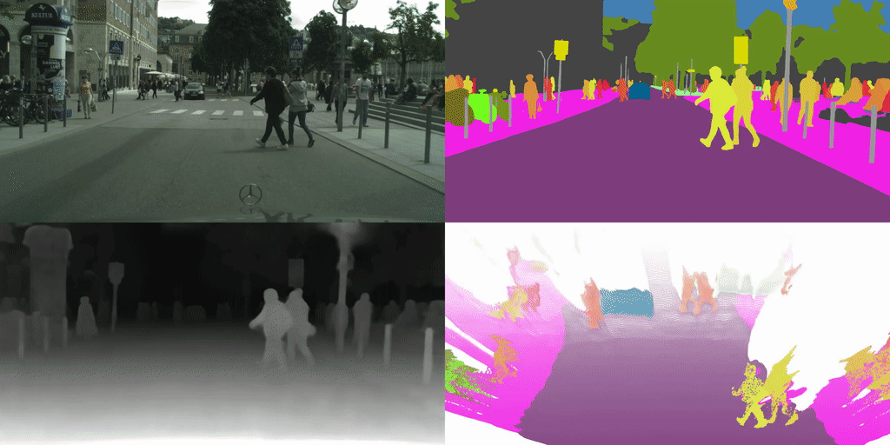

# ViP-DeepLab

ViP-DeepLab is a state-of-the-art system for the task depth-aware video panoptic
segmentation that aims to simultaneously tackle video panoptic segmentation [1]
and monocular depth estimation [2]. The goal is to assign a unique value that
encodes both semantic label and temporally consistent instance ID to every pixel
in an image while estimating its depth from the camera.

ViP-DeepLab extends Panoptic-DeepLab by adding network branches for depth and
video predictions. It is a unified model that jointly performs video panoptic
segmentation and monocular depth estimation for each pixel on the image plane,
and achieves state-of-the-art performance on several academic datasets for the
sub-tasks. The GIF below shows the results of ViP-DeepLab.

<p align="center">
   
</p>

## Prerequisite

1.  Make sure the software is properly [installed](../setup/installation.md).

2.  Make sure the target dataset is correctly prepared (e.g.,
    [SemKITTI-DVPS](https://github.com/joe-siyuan-qiao/ViP-DeepLab/tree/master/semkitti-dvps),
    [Cityscapes-DVPS](https://github.com/joe-siyuan-qiao/ViP-DeepLab/tree/master/cityscapes-dvps)).

3.  Download the pretrained Panoptic-DeepLab
    [checkpoints](./panoptic_deeplab.md) with ResNet-50-Beta for Cityscapes
    panoptic segmentation, and update the `initial_checkpoint` path in the
    config files.

## Citing ViP-DeepLab

If you find this code helpful in your research or wish to refer to the baseline
results, please use the following BibTeX entry.

*   ViP-DeepLab:

```
@inproceedings{vip_deeplab_2021,
  author={Siyuan Qiao and Yukun Zhu and Hartwig Adam and Alan Yuille and Liang-Chieh Chen},
  title={{ViP-DeepLab}: Learning Visual Perception with Depth-aware Video Panoptic Segmentation},
  booktitle={CVPR},
  year={2021}
}

```

*   Panoptic-DeepLab:

```
@inproceedings{panoptic_deeplab_2020,
  author={Bowen Cheng and Maxwell D Collins and Yukun Zhu and Ting Liu and Thomas S Huang and Hartwig Adam and Liang-Chieh Chen},
  title={{Panoptic-DeepLab}: A Simple, Strong, and Fast Baseline for Bottom-Up Panoptic Segmentation},
  booktitle={CVPR},
  year={2020}
}

```

### References

1.  Dahun Kim, Sanghyun Woo, Joon-Young Lee, and In So Kweon. "Video Panoptic
    Segmentation." In CVPR, 2020.

2.  David Eigen, Christian Puhrsch, and Rob Fergus. "Depth Map Prediction from a
    Single Image Using a Multi-Scale Deep Network." In NeurIPS, 2014.

3.  Marius Cordts, Mohamed Omran, Sebastian Ramos, Timo Rehfeld, Markus
    Enzweiler, Rodrigo Benenson, Uwe Franke, Stefan Roth, and Bernt Schiele,
    "The Cityscapes Dataset for Semantic Urban Scene Understanding." In
    CVPR, 2016.

4.  Andreas Geiger and Philip Lenz and Raquel Urtasun, "Are We Ready for
    Autonomous Driving? The KITTI Vision Benchmark Suite." In CVPR, 2012.

5.  Jens Behley, Martin Garbade, Andres Milioto, Jan Quenzel, Sven Behnke,
    Cyrill Stachniss, and Jurgen Gall. "SemanticKITTI: A Dataset for Semantic
    Scene Understanding of LiDAR Sequences." In ICCV, 2019.
