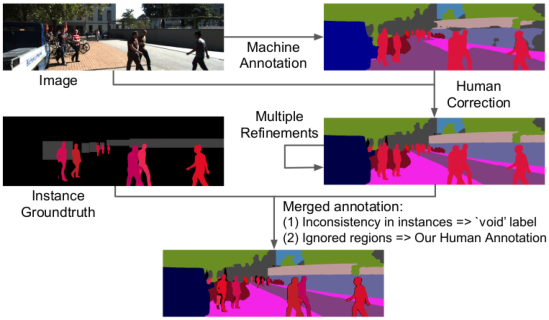

# Run DeepLab2 on KITTI-STEP dataset

## KITTI-STEP dataset

KITTI-STEP extends the existing
[KITTI-MOTS](http://www.cvlibs.net/datasets/kitti/eval_mots.php) dataset with
spatially and temporally dense annotations. KITTI-STEP dataset provides a
test-bed for studying long-term pixel-precise segmentation and tracking under
real-world conditions.

### Annotation

KITTI-STEP's annotation is collected in a semi-automatic manner. At the first
stage, the pseudo semantic labels generated by the state-of-the-art
[Panoptic-DeepLab](../projects/panoptic_deeplab.md) are refined by human
annotators with at least one round. Then this new semantic segmentation
annotation is merged with the existing tracking instance ground-truth from the
[KITTI-MOTS](http://www.cvlibs.net/datasets/kitti/eval_mots.php). Please refer
to the following figure as an overview.

<p align="center">
   
</p>

### Label Map

KITTI-STEP adopts the same 19 classes as defined in
[Cityscapes](https://www.cityscapes-dataset.com/dataset-overview/#class-definitions)
with `pedestrians` and `cars` carefully annotated with track IDs. More
specifically, KITTI-STEP has the following label to index mapping:

Label Name     | Label ID
-------------- | --------
road           | 0
sidewalk       | 1
building       | 2
wall           | 3
fence          | 4
pole           | 5
traffic light  | 6
traffic sign   | 7
vegetation     | 8
terrain        | 9
sky            | 10
person&dagger; | 11
rider          | 12
car&dagger;    | 13
truck          | 14
bus            | 15
train          | 16
motorcycle     | 17
bicycle        | 18
void           | 255

&dagger;: Single instance annotations are available.

### Prepare KITTI-STEP for Training and Evaluation

KITTI-STEP has the same train and test sequences as
[KITTI-MOTS](http://www.cvlibs.net/datasets/kitti/eval_mots.php) (with 21 and 29
sequences for training and testing, respectively). Similarly, the training
sequences are further split into training set (12 sequences) and validation set
(9 sequences).

In the following, we provide a step-by-step walk through to prepare the data.

1.  Create the KITTI-STEP directory:

    ```bash
    mkdir ${KITTI_STEP_ROOT}/images
    cd ${KITTI_STEP_ROOT}/images
    ```

2.  Download KITTI images from their
    [website](http://www.cvlibs.net/datasets/kitti/index.php) and unzip.

    ```bash
    wget ${KITTI_LINK}
    unzip ${KITTI_IMAGES}.zip
    ```

3.  To prepare the dataset for our scripts, we need to move and rename some
    directories:

    ```bash
    mv testing/image_02/ test/
    rm -r testing/

    # Move all validation sequences:
    mkdir val
    mv training/image_02/0002 val/
    mv training/image_02/0006 val/
    mv training/image_02/0007 val/
    mv training/image_02/0008 val/
    mv training/image_02/0010 val/
    mv training/image_02/0013 val/
    mv training/image_02/0014 val/
    mv training/image_02/0016 val/
    mv training/image_02/0018 val/

    # Move training sequences
    mv training/image_02/ train/
    rm -r training
    ```

4.  Download groundtruth KITTI-STEP panoptic maps from
    [here](https://storage.googleapis.com/gresearch/tf-deeplab/data/kitti-step.tar.gz).

    ```bash
    # Goto ${KITTI_STEP_ROOT}
    cd ..

    wget https://storage.googleapis.com/gresearch/tf-deeplab/data/kitti-step.tar.gz
    tar -xvf kitti-step.tar.gz
    mv kitti-step/panoptic_maps panoptic_maps
    rm -r kitti-step
    ```

The groundtruth panoptic map is encoded as follows in PNG format:

```
R = semantic_id
G = instance_id // 256
B = instance % 256
```

Following the above guide, your data structure should look like this:

```
.(KITTI_STEP_ROOT)
+-- images
|   |
|   +-- train
|   |   |
|   |   +-- sequence_id (%04d)
|   |       |
|   |       +-- frame_id.png (%06d.png)
|   |   ...
|   +-- val
|   +-- test
|
+-- panoptic_maps
     |
     +-- train
     |   |
     |   +-- sequence_id (%04d)
     |       |
     |       +-- frame_id.png (%06d.png)
     |   ...
     +-- val
```

DeepLab2 requires the dataset to be converted to TFRecords for efficient reading
and prefetching. To create the dataset for training and evaluation, run the
following command:

```bash
python deeplab2/data/build_step_data.py \
  --step_root=${KITTI_STEP_ROOT} \
  --output_dir=${OUTPUT_DIR}
```

This script outputs three sharded tfrecord files:
`{train|val|test}@10.tfrecord`. In the tfrecords, for `train` and `val` set, it
contains the RGB image pixels as well as their panoptic maps. For `test` set, it
contains RGB images only. These files will be used as the input for the model
training and evaluation.

Optionally, you can also specify with `--use_two_frames` to encode two
consecutive frames into the tfrecord files.

## Citing KITTI-STEP

If you find this dataset helpful in your research, please use the following
BibTeX entry.

```
@article{step_2021,
  author={Mark Weber and Jun Xie and Maxwell Collins and Yukun Zhu and Paul Voigtlaender and Hartwig Adam and Bradley Green and Andreas Geiger and Bastian Leibe and Daniel Cremers and Aljosa Osep and Laura Leal-Taixe and Liang-Chieh Chen},
  title={{STEP}: Segmenting and Tracking Every Pixel},
  journal={arXiv:2102.11859},
  year={2021}
}
```
